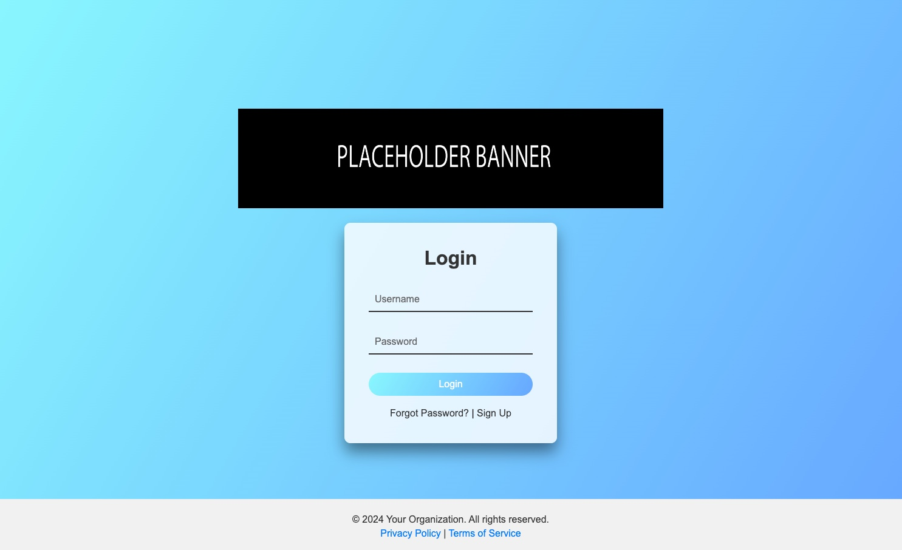

[](https://github.com/subnetmasked/Phishing-simulation/issues)
[](https://github.com/subnetmasked/Phishing-simulation/stargazers)
[](https://github.com/subnetmasked/Phishing-simulation/network)
[](https://github.com/subnetmasked/Phishing-simulation/blob/main/LICENSE)
[](https://github.com/subnetmasked/Phishing-simulation/graphs/contributors)

# Phishing Simulation 
### image showcase

A simple but effective phishing attack simulation solution.

## Installation 

### Prerequisites

- Python 3.x
- pip (Python package installer)
- Virtualenv (recommended)

### Steps

1. Clone the repository

```bash
git clone https://github.com/subnetmasked/Phishing-simulation.git
cd Phishing-simulation
```
2. Create and activate a virtual environment

```bash
python3 -m venv venv
source venv/bin/activate
```
3. Install the required packages

```bash
pip install -r requirements.txt
```
4. Run the application

```bash
python3 app.py
```
5. Open your browser and navigate to `http://localhost:5000`

## Usage 
1. Open the application in your browser.
2. Enter a username and password in the login form.
3. Click the `Login` button.
4. The submitted data will be stored in data.csv.

## Contributing
Pull requests are welcome. For major changes, please open an issue first to discuss what you would like to change.

1. Fork the repository
2. Create your feature branch (`git checkout -b feature/AmazingFeature`)
3. Commit your changes (`git commit -m 'Add some AmazingFeature'`)
4. Push to the branch (`git push origin feature/AmazingFeature`)
5. Open a pull request

## License
This project is licensed under the GNU General Public License v3.0 - see the [LICENSE](LICENSE) file for details.

## Contact Information
If you have any questions or suggestions, feel free to contact me at [subnetmasked@cock.li](mailto:subnetmasked@cock.li).
My PGP key is available [here](https://keys.openpgp.org/search?q=subnetmasked%40cock.li).

